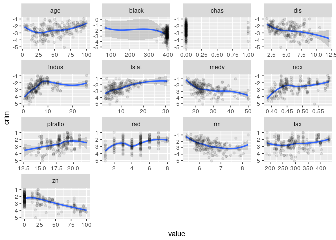
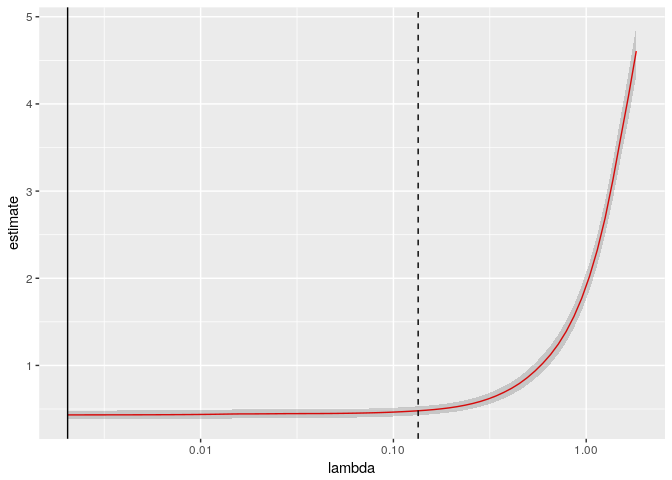
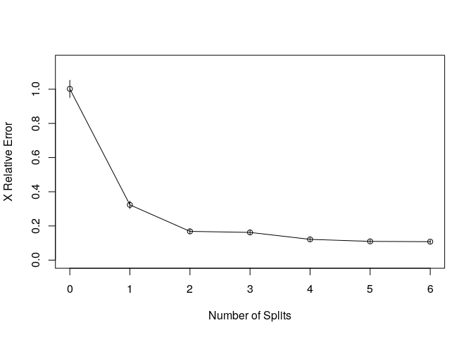

Boston Crime Analysis
================
Chase Baggett

Introduction
============

I will be attempting to model the crime rate in Boston as a response to multiple socio-economic factors. I will be using multiple statistical techniques and then comparing them to one another at the end of the project.

Data
====

The data comes from the MASS package.

<table>
<colgroup>
<col width="13%" />
<col width="12%" />
<col width="73%" />
</colgroup>
<thead>
<tr class="header">
<th>Type</th>
<th>Variable</th>
<th>Description</th>
</tr>
</thead>
<tbody>
<tr class="odd">
<td>Response</td>
<td>crim</td>
<td>per capita crime rate by town.</td>
</tr>
<tr class="even">
<td>Predictor</td>
<td>zn</td>
<td>proportion of residential land zoned for lots over 25,000 sq.ft.</td>
</tr>
<tr class="odd">
<td>Predictor</td>
<td>indus</td>
<td>proportion of non-retail business acres per town.</td>
</tr>
<tr class="even">
<td>Predictor</td>
<td>chas</td>
<td>Charles River dummy variable (= 1 if tract bounds river; 0 otherwise).</td>
</tr>
<tr class="odd">
<td>Predictor</td>
<td>nox</td>
<td>nitrogen oxides concentration (parts per 10 million).</td>
</tr>
<tr class="even">
<td>Predictor</td>
<td>rm</td>
<td>average number of rooms per dwelling.</td>
</tr>
<tr class="odd">
<td>Predictor</td>
<td>age</td>
<td>proportion of owner-occupied units built prior to 1940.</td>
</tr>
<tr class="even">
<td>Predictor</td>
<td>dis</td>
<td>weighted mean of distances to five Boston employment centres.</td>
</tr>
<tr class="odd">
<td>Predictor</td>
<td>rad</td>
<td>index of accessibility to radial highways.</td>
</tr>
<tr class="even">
<td>Predictor</td>
<td>tax</td>
<td>full-value property-tax rate per $10,000.</td>
</tr>
<tr class="odd">
<td>Predictor</td>
<td>ptratio</td>
<td>pupil-teacher ratio by town.</td>
</tr>
<tr class="even">
<td>Predictor</td>
<td>black</td>
<td>1000(Bk - 0.63)^2 where Bk is the proportion of blacks by town.</td>
</tr>
<tr class="odd">
<td>Predictor</td>
<td>lstat</td>
<td>lower status of the population (percent).</td>
</tr>
<tr class="even">
<td>Predictor</td>
<td>medv</td>
<td>median value of owner-occupied homes in $1000s.</td>
</tr>
</tbody>
</table>

Analyses
========

Train and Test
--------------

At the very beginning, I separate into training and test tests. Because of the small size of the data, I am going to use a small test set of only 20% of the data, and leave the remaining 80% for training.

``` r
set.seed(1)
train_idx <- sample(c(TRUE,FALSE), nrow(Boston),rep=TRUE,prob = c(.8,.2))

train <- Boston[train_idx,]
test <- Boston[!train_idx,]
```

### Correlation

Here can see how crime responds to our various predictors. For instance, I can see how as medv goes up, crime does down. This variable represents median home values. I can see a considerible difference with the naked eye up until about $150k houses.

What is very peculiar about this data, however, is the crowding of data on a few points.

``` r
library(tidyr)
plot_data <- gather(train,key = "crim")
colnames(plot_data) <- c("crim","predictor","value")
binary <- subset(plot_data,predictor=="chas")
plot_data <- subset(plot_data,!predictor %in% c("crim","Crime_Group","HighAccess","HighTax","LogCrim"))
non_binary <- subset(plot_data,predictor != "chas")
non_binary$value <- as.numeric(non_binary$value)
corr_plot <- ggplot(non_binary,aes(y=crim,x=value)) + 
  geom_smooth(method="loess") + 
  geom_point(alpha=.1) + 
  facet_wrap(~predictor,scales = "free") + 
   theme(axis.title.x=element_blank(),
        axis.text.x=element_blank(),
        axis.ticks.x=element_blank()) +
  ggtitle("Correlation of log(Crime) with Each of our Non-Binary Predictors")

corr_plot
```


As I can see below, several of our variables are crowded around one value of our X predictor. This means that a linear regression fit only on this value is guaranteed to have a large amount of pure error, because for the same x value I cannot possibly predict different y values. With a multiple regression I can hope that the natural error might be decreased by other variables or interraction terms. However, it is hard to trust the accuracy of predictors like ptratio,indus,tax,zone, or rad when the most diverse set of y values lie on exactly the same x value.

``` r
modal.value <- function(x, na.rm = FALSE) {
  if(na.rm){
    x = x[!is.na(x)]
  }

  ux <- unique(x)
  return(ux[which.max(tabulate(match(x, ux)))])
}


modal_values <- summarise(group_by(non_binary,predictor),
                Modal_Value = modal.value(value),
                Modal_Count = sum(ifelse(value==modal.value(value),1,0)),
                Total_Values = n())

modal_values$Percent_Modal <- modal_values$Modal_Count/modal_values$Total_Values                
datatable(modal_values[order(modal_values$Percent_Modal,decreasing = T),])
```


I also see a lot of non-linearity in the relationships. I am going to log transform our response to attempt to improve the linear relationships.

``` r
train$crim <- log(train$crim)
test$crim <- log(test$crim)
library(tidyr)
plot_data <- gather(train,key = "crim")
colnames(plot_data) <- c("crim","predictor","value")
binary <- subset(plot_data,predictor=="chas")
plot_data <- subset(plot_data,!predictor %in% c("crim","Crime_Group","HighAccess","HighTax","LogCrim"))
non_binary <- subset(plot_data,predictor != "chas")
non_binary$value <- as.numeric(non_binary$value)
corr_plot <- ggplot(non_binary,aes(y=crim,x=value)) + 
  geom_smooth(method="loess") + 
  geom_point(alpha=.1) + 
  facet_wrap(~predictor,scales = "free") + 
   theme(axis.title.x=element_blank(),
        axis.text.x=element_blank(),
        axis.ticks.x=element_blank()) +
  ggtitle("Correlation of Crime with Each of our Non-Binary Predictors")

corr_plot
```


High and Low Crimes Areas
-------------------------

Once I log the crim variable, I see that it is actually bimodal, with most zones being low crime, but some being very high crime. What I essentially see in the data is that there are two types of zones included.

``` r
ggdensity(train,"crim")
```


I suspect that I might have a variable that explains the difference, so I am using a hierarchical clusteirng to separate the crime into two groups. This is largely just an exploratory step to help me understand what is causing such a wide right tail.

``` r
train$Crime_Group <- as.factor( cutree(hclust(dist(train$crim)),k=2) - 1)
ggdensity(train,x="crim",color="Crime_Group")
```


Then, I can view the imbalance using a smooth between the two groups and each predictor. What I see almost immediately is that a few variables have fairly strong relationships, but that two variables have near perfect predictive power. rad, or distance from the radial highway, provides almost perfect separation. Almost every high crime area has a value of over 20, and almost all low crime areas have a value below 10. Tax provides an almost as good classification.

``` r
tail_data <- gather(train,key="Crime_Group")
colnames(tail_data) <- c("Group","predictor","value")
tail_data <- subset(tail_data,!predictor %in% c("crim","LogCrim"))
ggplot(tail_data,aes(y=as.numeric(Group),x=value)) + 
  geom_point(alpha=.1) + 
  geom_smooth(method="loess") + 
  facet_wrap(~predictor,scales="free")
```


Using a decision tree and only tax and rad variables, I can get nearly perfect classification of those values in the tail, versus those in the core the dataset, as can be seen by the confusion matrix below.

``` r
dec_tree <- rpart(Crime_Group ~ rad + tax,method="class",data=train)
pred = predict(dec_tree,type="class")
table(pred,train$Crime_Group)
```

    ##     
    ## pred   0   1
    ##    0 171  21
    ##    1  16 202

``` r
train$Group <- predict(dec_tree,type="class")
test$Group <- predict(dec_tree,type="class",newdata = test)
```

Why would I do this? Because I can't use the fact that an area is low or high crime in the prediction of its crime rate-- it is unknown at that point. However, I can separate areas into categories of high and low access vs tax, which might help us know which features it will exhibit.

One potential solution to this problem is usually piecewise functions that are able to treat the area with high pure error differently. However, given the simplicity of this problem and split, and how well the decision tree functions, the best approach might be to simply break apart the two groups and then interact the group with each variable.

The core of my hypothesis is that the model that performs best is the one that will know in advance what type of zone its looking at, because the relationship to response will be far more linear within a zone than across zones. So we will end up with an ensemble model that consumes our decision tree into the linear regression.

I can see below that this is reinforced by the data. In low crime areas, dis is a strong predictor, but for high crime areas, it is not. lstat is a strong predictor for both, but with a much higher slope for low crime areas.

``` r
library(tidyr)
low_crime_data <- gather(subset(train,Group==0),key = "crim")
high_crime_data <- gather(subset(train,Group==1),key = "crim")
colnames(low_crime_data) <- c("crim","predictor","value")
colnames(high_crime_data) <- c("crim","predictor","value")
low_crime_data$value <- as.numeric(low_crime_data$value)
high_crime_data$value <- as.numeric(high_crime_data$value)

p1 <- ggplot(low_crime_data,aes(y=crim,x=value)) + 
  geom_smooth(method="loess") + 
  geom_point(alpha=.1) + 
  facet_wrap(~predictor,scales = "free") + 
  ggtitle("Low Crime Zones")

p2 <- ggplot(high_crime_data,aes(y=crim,x=value)) + 
  geom_smooth(method="loess") + 
  geom_point(alpha=.1) + 
  facet_wrap(~predictor,scales = "free") + 
  ggtitle("High Crime Zones")

p1
```


``` r
p2
```


``` r
#cut my train back to original columns.
train <- train[,colnames(test)]
```

Manual Model Fit
----------------

First,I fit a model on all of our original variables, and look at the Residuals vs Fitted Plot, and confirm my initial suspicion of bimodality.

``` r
fit <- lm(crim~.-Group,data=train)
glance(fit)
```

    ##   r.squared adj.r.squared     sigma statistic       p.value df    logLik
    ## 1 0.8762816     0.8722202 0.7698459  215.7553 1.582896e-170 14 -467.4009
    ##        AIC      BIC deviance df.residual
    ## 1 964.8017 1025.044 234.6944         396

``` r
plot(fit,which=1)
```


I will do stepwise regression to trim this model to fewer predictors. The adjusted *R*<sup>2</sup> stays roughly the same despite removing 4 variables.

``` r
fit <- step(fit,direction = "both",trace = F)
glance(fit)
```

    ##   r.squared adj.r.squared     sigma statistic       p.value df    logLik
    ## 1 0.8759483     0.8731571 0.7670183  313.8291 3.351609e-175 10 -467.9525
    ##       AIC      BIC deviance df.residual
    ## 1 957.905 1002.083 235.3268         400

However, now I want to try to use my created Group variable, which is formed via hierarchical clustering of rad and tax, and fit separate models for the two distinct groups.

``` r
train_0 <- subset(train,Group==0)[,!colnames(train) %in% "Group"]
fit_0 <- lm(crim~.,data=train_0)

train_1 <- subset(train,Group==1)[,!colnames(train) %in% "Group"]
fit_1 <- lm(crim~.,data=train_1)
```

Fit on Low Crime Areas:

``` r
glance(fit_0)
```

    ##   r.squared adj.r.squared     sigma statistic      p.value df   logLik
    ## 1  0.589342     0.5593501 0.5499479  19.65005 5.049642e-28 14 -150.365
    ##        AIC      BIC deviance df.residual
    ## 1 330.7299 379.5924  53.8348         178

Fit on High Crime Areas:

``` r
glance(fit_1)
```

    ##   r.squared adj.r.squared     sigma statistic      p.value df   logLik
    ## 1 0.8804607      0.872843 0.6058362  115.5809 1.853115e-86 14 -192.844
    ##       AIC      BIC deviance df.residual
    ## 1 415.688 466.4554 74.87566         204

Why is our fit so poor on low crime areas? Well, let's take a look at the data. Many of our terms look highly nonlinear, almost bending around from positive to negative slope. I am forced to believe that in large part this problem might be fundamentally non-linear. Piecewise regression, or tools like decision trees, might perform significantly better.

``` r
long_data <- gather(train_0,key="crim")
colnames(long_data)[2] <- "predictor"
ggplot(long_data,aes(y=crim,x=value)) + geom_smooth(method="loess") + geom_point(alpha=.1) + facet_wrap(~predictor,scales="free")
```



To show this, I've written a function that uses model based clustering to break a variable into logical cut points. Below I see the nox and medv variable broken like this. It is easy to see that there would be different ideal slopes in some of the different groups.

``` r
piecewise_plot <- function(y,x){
  p_data <- data.frame(y=y,x=x)
  p_data <- p_data[order(x),]
  
  #Monotonically Increasing Cumulative Sum to Ensure Whole Clusters
  p_data$g <-predict(Mclust(cumsum(abs(log(p_data$x)))))$classification
  
  
  ggplot(p_data,aes(y=y,x=x,color=as.factor(g))) + geom_point() + guides(color=guide_legend(title="Group"))
}
piecewise_plot(train$crim,train$nox) + ggtitle("nox")
```


``` r
piecewise_plot(train$crim,train$medv) + ggtitle("medv")
```


However, for my final manually constructed model, I will interact Group with our other predictors to allow the regression model to pick out the differences in slope between the high and low crime areas via our classifier which will help us know which I are dealing with ahead of time.

``` r
fit_group <- lm(crim~Group*(zn + indus + chas + nox + rm + age + dis + rad + tax + ptratio + black + lstat + medv),data=train)
glance(fit_group)
```

    ##   r.squared adj.r.squared     sigma statistic       p.value df    logLik
    ## 1 0.9321507     0.9273551 0.5804639  194.3751 8.188356e-205 28 -344.2535
    ##       AIC      BIC deviance df.residual
    ## 1 746.507 862.9755 128.7105         382

I will also use stepwise selection trim back the predictors in this model.

``` r
fit_group <- step(fit_group,direction="both",trace = F)
glance(fit_group)
```

    ##   r.squared adj.r.squared     sigma statistic       p.value df    logLik
    ## 1 0.9315393     0.9274601 0.5800443  228.3598 9.432869e-209 24 -346.0924
    ##        AIC      BIC deviance df.residual
    ## 1 742.1849 842.5888 129.8703         386

Best Subset Slection
--------------------

Best subset is viable because of how few predictors I have and how small our dataset is, so I will use it to look at the possible additive linear models. Using it, I can see that our BIC is minimized at 2 variables, but that Mallows Cp sees additional value from 3 to 4. *R*<sup>2</sup> and RSS are, as expected, monotonic. We'll risk a bit of overfitting and use 4 variables.

``` r
bestsubset.fit = regsubsets(crim ~.,train)
bestsubset.summary = summary(bestsubset.fit)
bestsubset.overview <- data.frame(RSS=bestsubset.summary$rss,
                                  AdjR=bestsubset.summary$adjr2,
                                  Cp=bestsubset.summary$cp,
                                  BIC=bestsubset.summary$bic
                                  )

bestsubset.overview$Predictors <- 1:nrow(bestsubset.overview)
ggplot(melt(bestsubset.overview,id.vars = "Predictors"),aes(x=Predictors,y=value)) +
  geom_line() + 
  facet_wrap(~variable,scales = "free")
```


Here, I can see the best subset model with 3 variables includes zn, nox, rad, lstat, and the group variable I created via clustering. I will store this model and come back to it at the end for comparison to other models.

``` r
bestsubsets.models <- as.data.frame(bestsubset.summary$which)
bestsubsets.models[5,]
```

    ##   (Intercept)   zn indus  chas  nox    rm   age   dis  rad   tax ptratio
    ## 5        TRUE TRUE FALSE FALSE TRUE FALSE FALSE FALSE TRUE FALSE   FALSE
    ##   black lstat  medv Group1
    ## 5 FALSE  TRUE FALSE   TRUE

``` r
bestsubset.final_model <- lm(crim ~ zn + nox + rad + lstat + Group,data=train)
```

Here I can see an overview of the model's performance.

``` r
glance(bestsubset.final_model)
```

    ##   r.squared adj.r.squared     sigma statistic       p.value df    logLik
    ## 1  0.906949     0.9057973 0.6610042  787.5407 9.053134e-206  6 -409.0047
    ##        AIC      BIC deviance df.residual
    ## 1 832.0093 860.1224 176.5183         404

As well as the coefficients.

``` r
tidy(bestsubset.final_model)
```

    ##          term    estimate   std.error  statistic      p.value
    ## 1 (Intercept) -4.71051341 0.215947956 -21.813188 2.838026e-70
    ## 2          zn -0.01039925 0.001633123  -6.367711 5.222745e-10
    ## 3         nox  3.23871749 0.448364736   7.223399 2.543199e-12
    ## 4         rad  0.12379907 0.004986993  24.824392 2.738549e-83
    ## 5       lstat  0.03419036 0.005783788   5.911414 7.221588e-09
    ## 6      Group1  1.20575245 0.093261230  12.928764 3.074672e-32

Lasso Regression
----------------

Lasso regression is similar to best subsets in that it can be used to perform variable selection by using a lambda value to reduce coefficients to zero. I will compare its selection to that of bestsubsets. I will find the best value of lambda via cross validation.

I can see that the lasso method returned different variables. Our Lasso was built with cross-validation to pick the right value of *λ*, whereas our subset selection was built with the training set all at once.

``` r
y_train <- train$crim
x_train <- model.matrix(crim ~.,train)

y_test <- test$crim
x_test <- model.matrix(crim ~.,test)

set.seed(1)
lasso.fit = glmnet(x_train,y_train,alpha=1)
lasso.cvfit = cv.glmnet(x_train,y_train,alpha=1)
lasso.coef = predict(lasso.fit,type = "coefficients",s = lasso.cvfit$lambda.min)
datatable(data.frame(name = lasso.coef@Dimnames[[1]][lasso.coef@i + 1], 
           coefficient = lasso.coef@x))
```

 I can visualize the lambda we've chosen, with the minimum lambda as a solid line, and one standard error lambda as a dashed line.

``` r
lasso.tidy <- tidy(lasso.cvfit)
lasso.glance <- glance(lasso.cvfit)
ggplot(lasso.tidy, aes(lambda, estimate)) + geom_line(color = "red") +
    geom_ribbon(aes(ymin = conf.low, ymax = conf.high), alpha = .2) +
    scale_x_log10() +
    geom_vline(xintercept = lasso.glance$lambda.min) +
    geom_vline(xintercept = lasso.glance$lambda.1se, lty = 2)
```



Ridge Regression
----------------

Unlike lasso and best subset, ridge regression cannot be used for outright variable selection on its own, as the ridge will reduce the coefficients near sometimes, but never actually to zero. Ridge should be expected to be more logical for designed experiments where there is a strong first principle reason to believe most of the predictors have an effect on the response.

I will fit a ridge regression to the training set and compare it to lasso and best subset. I will see that every variable remains in the model. In fact, age, which was dropped by both of the other models, ends up with the second largest coefficient by absolute value.

``` r
set.seed(1)
ridge.fit = glmnet(x_train,y_train,alpha=0)
ridge.cvfit=cv.glmnet(x_train,y_train,alpha=0)
ridge.coef = coef(ridge.fit,s=ridge.cvfit$lambda.min)
datatable(data.frame(name = ridge.coef@Dimnames[[1]][ridge.coef@i + 1], 
           coefficient = ridge.coef@x))
```

 I will also visualize the lambda selection for ridge regression.

``` r
ridge.tidy <- tidy(ridge.cvfit)
ridge.glance <- glance(ridge.cvfit)
ggplot(ridge.tidy, aes(lambda, estimate)) + geom_line(color = "red") +
    geom_ribbon(aes(ymin = conf.low, ymax = conf.high), alpha = .2) +
    scale_x_log10() +
    geom_vline(xintercept = ridge.glance$lambda.min) +
    geom_vline(xintercept = ridge.glance$lambda.1se, lty = 2)
```


Regression Tree
---------------

Because I see a few complex changes in direction of the linear trend, I want to try a regression tree as a solution to this problem. Because the tree will fit multiple models, it should be able to treat parts of our data differently, and I believe will perform significantly better on this type of problem. I have a fundamentally non-linear problem wherein a few of our zones are considerably different than the others.

I can see right off the bat the tree is picking up on the fact that there's an imbalance, only 6% of our records go down the right path of the tree.

``` r
tree.fit <- rpart(crim~.,data=train,method="anova")
visTree(tree.fit)
```


I can also see that a large amount of the error is corrected by the first split alone. After that, I continue, however, to get marginal cross-validated benefit from every split, though very little benefit near the last few splits.

``` r
rsq.rpart(tree.fit)
```

    ## 
    ## Regression tree:
    ## rpart(formula = crim ~ ., data = train, method = "anova")
    ## 
    ## Variables actually used in tree construction:
    ## [1] dis     Group   indus   medv    ptratio rad    
    ## 
    ## Root node error: 1897/410 = 4.6268
    ## 
    ## n= 410 
    ## 
    ##         CP nsplit rel error  xerror      xstd
    ## 1 0.679852      0  1.000000 1.00181 0.0505713
    ## 2 0.153510      1  0.320148 0.32328 0.0218356
    ## 3 0.032821      2  0.166638 0.16825 0.0139764
    ## 4 0.026959      3  0.133816 0.16201 0.0138926
    ## 5 0.014160      4  0.106857 0.12140 0.0097655
    ## 6 0.010176      5  0.092697 0.10961 0.0092927
    ## 7 0.010000      6  0.082521 0.10782 0.0092932



I can perform cross validation on our tree and automatically prune the tree based on that cross-validation.

``` r
plotcp(tree.fit)
```


``` r
unpruned <- tree.fit
tree.fit <- prune(tree.fit, cp=tree.fit$cptable[which.min(tree.fit$cptable[,"xerror"]),"CP"])
```

However, every variable is found valuable during cross-validation, so the tree does not change.

``` r
visTree(tree.fit)
```


Conclusion
==========

Now, I am going to take each of the 3 models and test them against our test set that I have not yet looked at.

``` r
test$BestSubset <- predict(bestsubset.final_model, newdata = test)
test$Lasso <-
predict(lasso.fit, newx = x_test, s = lasso.cvfit$lambda.min)
test$Ridge <-
predict(ridge.fit, newx = x_test, s = ridge.cvfit$lambda.min)
test$`Full Model` <- predict(fit, newdata = test)
test$`Grouped Interraction` <- predict(fit_group, newdata = test)
test$`Regression Tree` <- predict(tree.fit, newdata = test)
test$`Unpruned Tree` <- predict(unpruned,newdata=test)
results <-
test[, c(
"crim",
"BestSubset",
"Lasso",
"Ridge",
"Full Model",
"Grouped Interraction",
"Regression Tree",
"Unpruned Tree"
)]
results <- gather(results, key = "crim")
colnames(results)[2] <- "model"
results$squared_error <- (results$value - results$crim) ^ 2
final <- summarise(group_by(results, model), MSE = mean(squared_error))
final <- final[order(final$MSE),]
datatable(final)
```


In the end, the model that is the grouped interraction worked best, with the regression tree very close. Both models that were able to separate high and low crime areas and treat them differently overperformed the linear regression techniques regardless of how they estimated coefficients or selected predictors.

Final Model
-----------

### High or Low Crime Predictor

The group variable is defined by the training set and then predicted upon the test set before final prediction, using hierarchical clustering via euclidian distance and the "complete" agglomeration method. We use the training set to build a model that predicts this grouping on the training set using a decision tree using only the rad and tax variables.

### Final Model

The final model then becomes an ensemble model that consumes the High or Low Crime Prediction model. This model is more complex than a simple linear regression, but due to the bimodality of the data I believe it will always outperform pure linear regression-- though with enough data, I believe gradient boosted or random forest regression trees could outperform my model by performing more natural breaks in the modality and finding more complex interractions. However, without more data, these techniques risk of considerible overfitting.

The winning model, thus, is:

``` r
fit_group$call
```

    ## lm(formula = crim ~ Group + zn + indus + chas + nox + rm + age + 
    ##     dis + rad + tax + ptratio + black + lstat + medv + Group:indus + 
    ##     Group:chas + Group:nox + Group:age + Group:rad + Group:tax + 
    ##     Group:ptratio + Group:lstat + Group:medv, data = train)

with the coeffients:

``` r
tidy(fit_group)
```

    ##              term      estimate    std.error  statistic      p.value
    ## 1     (Intercept) -3.0350690247 1.0235658375 -2.9651918 3.212821e-03
    ## 2          Group1  3.9976638581 1.2030448719  3.3229549 9.757728e-04
    ## 3              zn -0.0109005718 0.0020926400 -5.2090049 3.096190e-07
    ## 4           indus  0.0222954505 0.0125043157  1.7830204 7.536869e-02
    ## 5            chas  0.2021516690 0.2173480084  0.9300829 3.529094e-01
    ## 6             nox -3.3135861229 1.4696106123 -2.2547375 2.470962e-02
    ## 7              rm -0.1123509207 0.0655241666 -1.7146486 8.721232e-02
    ## 8             age -0.0025296874 0.0026292050 -0.9621492 3.365770e-01
    ## 9             dis -0.0477384061 0.0316864684 -1.5065865 1.327346e-01
    ## 10            rad  0.1429428164 0.0272231362  5.2507843 2.507200e-07
    ## 11            tax  0.0015138738 0.0007721350  1.9606336 5.064057e-02
    ## 12        ptratio  0.0721842953 0.0288284761  2.5039234 1.269431e-02
    ## 13          black -0.0008109879 0.0003844446 -2.1095055 3.554428e-02
    ## 14          lstat  0.0659213634 0.0142913369  4.6126799 5.415489e-06
    ## 15           medv  0.0221390197 0.0100044100  2.2129261 2.748720e-02
    ## 16   Group1:indus  0.0373226431 0.0192696547  1.9368610 5.349175e-02
    ## 17    Group1:chas -0.5539401560 0.2590643850 -2.1382335 3.312515e-02
    ## 18     Group1:nox  4.2295680642 1.5925160274  2.6559030 8.237455e-03
    ## 19     Group1:age  0.0161493358 0.0036732411  4.3964813 1.424266e-05
    ## 20     Group1:rad  0.0628664112 0.0309018444  2.0343903 4.259537e-02
    ## 21     Group1:tax -0.0075464447 0.0012459744 -6.0566610 3.300160e-09
    ## 22 Group1:ptratio -0.1501258792 0.0397610688 -3.7757003 1.846771e-04
    ## 23   Group1:lstat -0.0536655594 0.0166442342 -3.2242733 1.370439e-03
    ## 24    Group1:medv -0.0327683069 0.0115145743 -2.8458114 4.666133e-03
